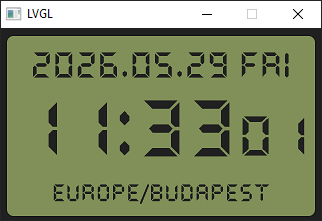
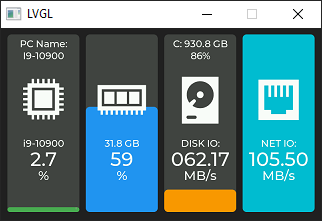
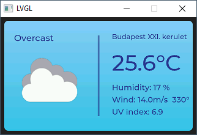
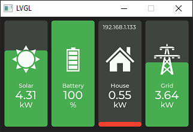
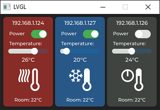
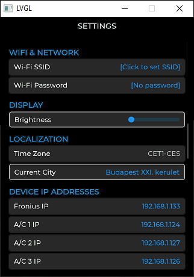

LVGL PC Emulator — WT32 SC01 PLUS UI

Ez a projekt a WT32 SC01 PLUS eszközre fejlesztett grafikus felület PC-s LVGL emulátora.  
Célja, hogy a teljes UI Windows környezetben futtatható és tesztelhető legyen, fizikai hardver nélkül.

---

## Projekt felépítése

A repó csak a projekt saját forrásfájljait tartalmazza:

src/
app.c
app.h
cJSON.c
cJSON.h
gree_backend.c
gree_backend_stub.c
time_service.c
ui_common.c
screen_page1.c
screen_page2.c
screen_page3.c
screen_page4.c
screen_page5.c
screen_page6.c

fonts/
pictures/

CMakeLists.txt
config.json
README.md

A következő mappák nem részei a repónak, de a futtatáshoz szükségesek:

lvgl/      → LVGL 9 könyvtár (külön letöltendő)
build/     → CMake build output
.vs/       → Visual Studio környezeti fájlok

---

## Szükséges környezet

A projekt futtatásához az alábbiak szükségesek:

Windows 10/11
CMake 3.20+
Visual Studio 2022 (MSVC)
LVGL 9 könyvtár
C fordító (MSVC / Clang / MinGW)

---

## LVGL könyvtár elhelyezése

A projekt az LVGL 9 könyvtárat használja.  
A könyvtárat a projekt gyökerébe kell elhelyezni:

lvgl_pc_emulator/
lvgl/

---

## Build lépések (Windows + CMake)

mkdir build
cd build
cmake ..
cmake --build .

A futtatható állomány a `build/` mappában jön létre.

---

## Futtatás

Windows: build/lvgl_pc_emulator.exe

A program betölti:

- a teljes LVGL UI-t,
- a képeket (pictures/),
- a fontokat (fonts/),
- a konfigurációt (config.json),
- a backend stubot (PC-n automatikusan).

---

## Backend működés

gree_backend.c        → valódi eszközkommunikáció
gree_backend_stub.c   → PC-s emuláció, hardver nélkül

A PC-s build automatikusan a stubot használja.

---

## Konfiguráció

A `config.json` tartalmazza:

UI beállítások
backend konfiguráció
időszolgáltatás paraméterei
eszköz-specifikus értékek

A fájl szabadon módosítható futtatás előtt.

---

## UI képernyőképek

### Time

### Telemetria

### Időjárás

### Fronius

### Gree klímák

### Settings

---

## Készítő

Kuba István Alexander — ZVATRS - 2026